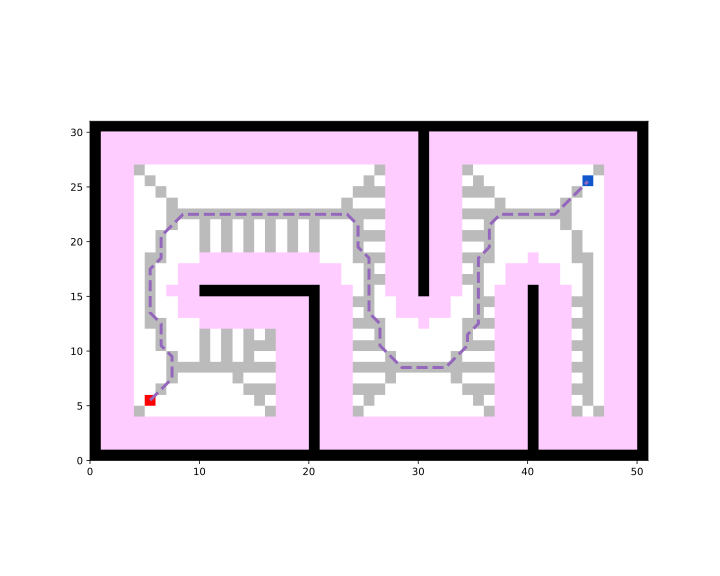

Create the path-planner and plan the path. The hybrid search planner **Voronoi Planner** create the Voronoi map and then depends on **A\*** to plan the path. You can change the base planner by setting argument `base_planner` and pass arguments to base planner by argument `base_planner_kwargs`.

```python
planner = VoronoiPlanner(map_=map_, start=start, goal=goal, base_planner=AStar)
path, path_info = planner.plan()
print(path)
print(path_info)
```

Print results:
```
[(5, 5), (5, 5), (6, 6), (7, 7), (7, 8), (7, 9), (6, 10), (6, 11), (6, 12), (5, 13), (5, 14), (5, 15), (5, 16), (5, 17), (6, 18), (6, 19), (6, 20), (7, 21), (8, 22), (9, 22), (10, 22), (11, 22), (12, 22), (13, 22), (14, 22), (15, 22), (16, 22), (17, 22), (18, 22), (19, 22), (20, 22), (21, 22), (22, 22), (23, 22), (24, 21), (24, 20), (24, 19), (25, 18), (25, 17), (25, 16), (25, 15), (25, 14), (25, 13), (26, 12), (26, 11), (26, 10), (27, 9), (28, 8), (29, 8), (30, 8), (31, 8), (32, 8), (33, 9), (34, 10), (34, 11), (35, 12), (35, 13), (35, 14), (35, 15), (35, 16), (35, 17), (35, 18), (36, 19), (36, 20), (36, 21), (37, 22), (38, 22), (39, 22), (40, 22), (41, 22), (42, 22), (43, 23), (44, 24), (45, 25), (45, 25)]
{'success': True, 'start': (5, 5), 'goal': (45, 25), 'length': 80.28427124746187, 'cost': 80.28427124746187, 'expand': {(5, 5): Node((5, 5), None, 0, 44.721359549995796), ...}, 'voronoi_candidates': array([[False, False, False, ..., False, False, False], ...]), 'voronoi_start': (5, 5), 'voronoi_goal': (45, 25), 'voronoi_path': [(5, 5), (6, 6), (7, 7), (7, 8), (7, 9), (6, 10), (6, 11), (6, 12), (5, 13), (5, 14), (5, 15), (5, 16), (5, 17), (6, 18), (6, 19), (6, 20), (7, 21), (8, 22), (9, 22), (10, 22), (11, 22), (12, 22), (13, 22), (14, 22), (15, 22), (16, 22), (17, 22), (18, 22), (19, 22), (20, 22), (21, 22), (22, 22), (23, 22), (24, 21), (24, 20), (24, 19), (25, 18), (25, 17), (25, 16), (25, 15), (25, 14), (25, 13), (26, 12), (26, 11), (26, 10), (27, 9), (28, 8), (29, 8), (30, 8), (31, 8), (32, 8), (33, 9), (34, 10), (34, 11), (35, 12), (35, 13), (35, 14), (35, 15), (35, 16), (35, 17), (35, 18), (36, 19), (36, 20), (36, 21), (37, 22), (38, 22), (39, 22), (40, 22), (41, 22), (42, 22), (43, 23), (44, 24), (45, 25)]}
```

Visualize.
```python
if "voronoi_candidates" in path_info:
    map_.type_map[path_info["voronoi_candidates"]] = TYPES.CUSTOM
    map_.type_map[start] = TYPES.START
    map_.type_map[goal] = TYPES.GOAL
    
vis = Visualizer2D()
vis.plot_grid_map(map_)
vis.plot_path(path, style="--", color="C4")
vis.show()
vis.close()
```



Runnable complete code:

```python
import random
random.seed(0)

import numpy as np
np.random.seed(0)

from python_motion_planning.common import *
from python_motion_planning.path_planner import *
from python_motion_planning.controller import *

map_ = Grid(bounds=[[0, 51], [0, 31]])

map_.fill_boundary_with_obstacles()
map_.type_map[10:21, 15] = TYPES.OBSTACLE
map_.type_map[20, :15] = TYPES.OBSTACLE
map_.type_map[30, 15:] = TYPES.OBSTACLE
map_.type_map[40, :16] = TYPES.OBSTACLE

map_.inflate_obstacles(radius=3)

start = (5, 5)
goal = (45, 25)

map_.type_map[start] = TYPES.START
map_.type_map[goal] = TYPES.GOAL

planner = VoronoiPlanner(map_=map_, start=start, goal=goal, base_planner=AStar)
path, path_info = planner.plan()
print(path)
print(path_info)
if "voronoi_candidates" in path_info:
    map_.type_map[path_info["voronoi_candidates"]] = TYPES.CUSTOM
    map_.type_map[start] = TYPES.START
    map_.type_map[goal] = TYPES.GOAL

vis = Visualizer2D()
vis.plot_grid_map(map_)
vis.plot_path(path, style="--", color="C4")
vis.show()
vis.close()
```

For more planners and their arguments, please refer to API Reference.