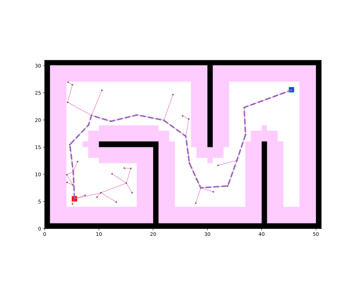
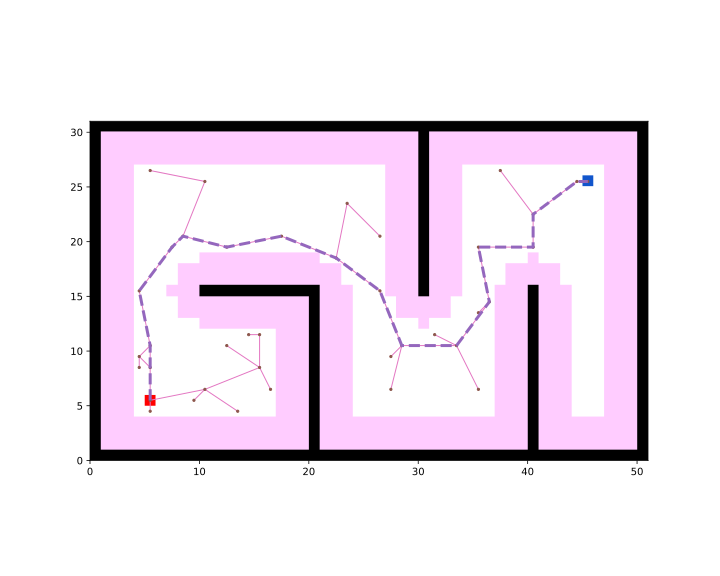
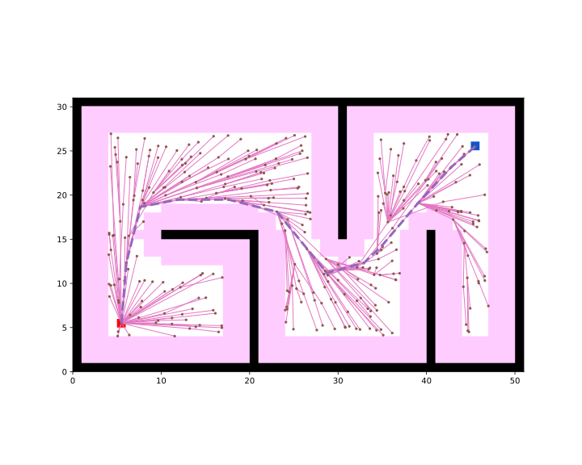

Create the path-planner and plan the path.
```python
planner = RRT(map_=map_, start=start, goal=goal)
path, path_info = planner.plan()
print(path)
print(path_info)
```

Print results:
```
[(5, 5), (4.771426907962659, 9.994772701694892), (4.146819953608962, 14.95560591322025), (7.595267976529573, 18.57613159787088), (8.140654910970852, 20.351857470764628), (11.710213969483886, 19.259381435008308), (16.5716134378916, 20.42848160546643), (21.474677851991277, 19.448706452082046), (25.521418626996706, 16.5120605592464), (26.18397115095867, 11.556152554350462), (28.275306073720905, 7.01453189198388), (33.2635891537154, 7.3566311668159745), (34.94476916317723, 12.065519971596348), (36.536019764598414, 16.805553887453566), (36.26977232128116, 21.798460085143148), (40.964074570672786, 23.519949670170227), (45, 25)]
{'success': True, 'start': (5, 5), 'goal': (45, 25), 'length': 74.88933689304858, 'cost': 74.88933689304858, 'expand': {(5, 5): Node((5, 5), None, 0, 0), ...}}
```

Visualize.
```python
vis = Visualizer2D()
vis.plot_grid_map(map_)
vis.plot_path(path, style="--", color="C4")
vis.plot_expand_tree(path_info["expand"])   # sample-search-featured expand 
vis.show()
vis.close()
```



Runnable complete code:

```python
import random
random.seed(0)

import numpy as np
np.random.seed(0)

from python_motion_planning.common import *
from python_motion_planning.path_planner import *
from python_motion_planning.controller import *

map_ = Grid(bounds=[[0, 51], [0, 31]])

map_.fill_boundary_with_obstacles()
map_.type_map[10:21, 15] = TYPES.OBSTACLE
map_.type_map[20, :15] = TYPES.OBSTACLE
map_.type_map[30, 15:] = TYPES.OBSTACLE
map_.type_map[40, :16] = TYPES.OBSTACLE

map_.inflate_obstacles(radius=3)

start = (5, 5)
goal = (45, 25)

map_.type_map[start] = TYPES.START
map_.type_map[goal] = TYPES.GOAL

planner = RRT(map_=map_, start=start, goal=goal)
path, path_info = planner.plan()
print(path)
print(path_info)

vis = Visualizer2D()
vis.plot_grid_map(map_)
vis.plot_path(path, style="--", color="C4")
vis.plot_expand_tree(path_info["expand"])
vis.show()
vis.close()
```

Sample search planners plan in continuous space by default. If you want to plan in discrete grid map, just set argument `discrete` to `True`. For example:

```python
planner = RRT(map_=map_, start=start, goal=goal, discrete=True)
```

Print results:
```
[(5, 5), (5, 10), (4, 15), (7, 19), (8, 20), (12, 19), (17, 20), (22, 18), (26, 15), (28, 10), (33, 10), (36, 14), (35, 19), (40, 19), (40, 22), (44, 25), (45, 25)]
{'success': True, 'start': (5, 5), 'goal': (45, 25), 'length': 70.60470734303811, 'cost': 70.60470734303811, 'expand': {(5, 5): Node((5, 5), None, 0, 0), ...}}
```



For asymptoticaly optimal sample search planners like **RRT\***, you can set argument `stop_until_sample_num` to `True` and configure `sample_num` to wait for a better result. For example:

```python
RRTStar(map_=map_, start=start, goal=goal, sample_num=1000, stop_until_sample_num=True)
```



For more sample search planners and their arguments, please refer to API Reference.