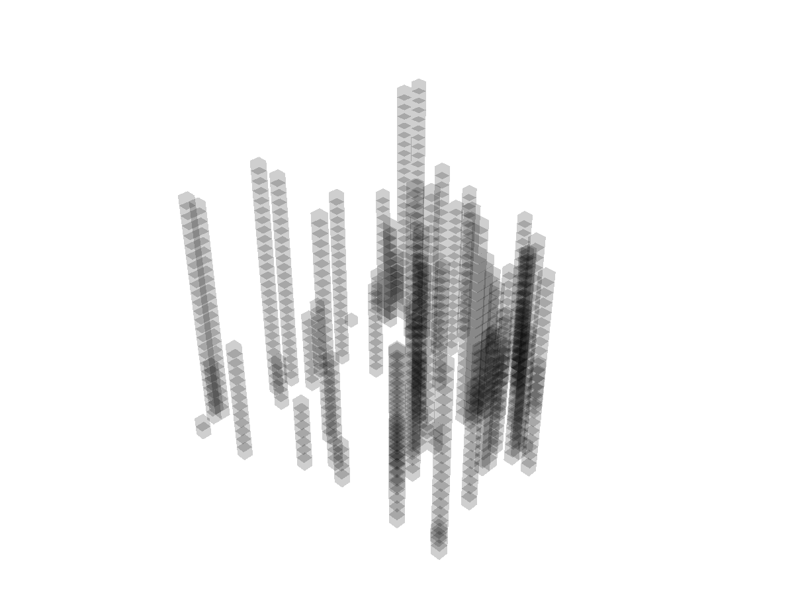

Fix the random seed to ensure reproducible results.

```python
import random
random.seed(0)

import numpy as np
np.random.seed(0)
```

Import necessary modules.

```python
from python_motion_planning.common import *
from python_motion_planning.path_planner import *
from python_motion_planning.controller import *
```

Define the grid map and add and inflate obstacles.

```python
map_ = Grid(bounds=[[0, 31], [0, 31], [0, 31]], resolution=1.0)
for i in range(75):     # 75 random obstacles
    rd_p = tuple(np.random.randint(0, 30, size=3))
    map_.type_map[rd_p[0], rd_p[1], :rd_p[2]] = TYPES.OBSTACLE
map_.inflate_obstacles(radius=3)
```

Visualize to check the map.

```python
vis = Visualizer3D()
vis.plot_grid_map(map_)
vis.show()
vis.close()
```



Runnable complete code:

```python
import random
random.seed(0)

import numpy as np
np.random.seed(0)

from python_motion_planning.common import *
from python_motion_planning.path_planner import *
from python_motion_planning.controller import *

map_ = Grid(bounds=[[0, 31], [0, 31], [0, 31]], resolution=1.0)
for i in range(75):
    rd_p = tuple(np.random.randint(0, 30, size=3))
    map_.type_map[rd_p[0], rd_p[1], :rd_p[2]] = TYPES.OBSTACLE
map_.inflate_obstacles(radius=3)

vis = Visualizer3D()
vis.plot_grid_map(map_)
vis.show()
vis.close()
```

3D visualization is based on PyVista. If you want to save the figure, you need to set argument `off_screen` to `True` and comment `vis.show()`. Below is an example to save a figure:

```python
vis = Visualizer3D(show_axes=False, off_screen=True)
vis.plot_grid_map(map_)
# vis.show()
vis.savefig("../assets/rrt_3d_discrete.png")
vis.close()
```