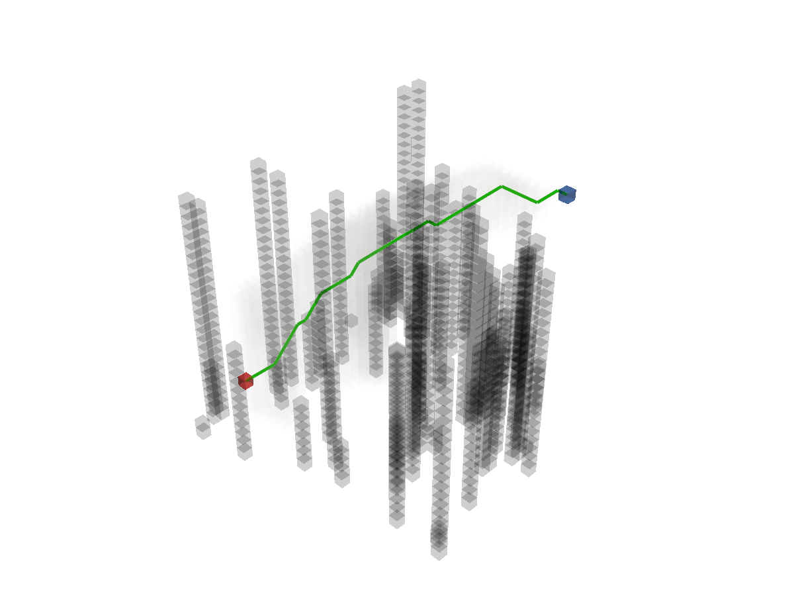

Define start and goal points.

```python
start = (25, 5, 5)
goal = (5, 25, 25)
```

Add the start and goal points to the map.
```python
map_.type_map[start] = TYPES.START
map_.type_map[goal] = TYPES.GOAL
```

Create the path-planner and plan the path.
```python
planner = AStar(map_=map_, start=start, goal=goal)
path, path_info = planner.plan()
print(path)
print(path_info)
```

Print results:
```
[(25, 5, 5), (24, 6, 6), (23, 7, 7), (22, 7, 8), (21, 7, 9), (20, 7, 10), (19, 7, 10), (18, 7, 11), (17, 7, 12), (16, 8, 13), (15, 9, 14), (14, 9, 15), (13, 10, 16), (12, 11, 17), (11, 12, 18), (10, 12, 18), (9, 13, 19), (9, 14, 19), (8, 15, 20), (7, 16, 21), (6, 17, 22), (5, 18, 23), (5, 19, 23), (5, 20, 23), (5, 21, 23), (5, 22, 23), (5, 23, 24), (5, 24, 25), (5, 25, 25)]
{'success': True, 'start': (25, 5, 5), 'goal': (5, 25, 25), 'length': 40.09831818981128, 'cost': 40.09831818981128, 'expand': {(25, 5, 5): Node((25, 5, 5), None, 0, 34.64101615137755), ...}}
```

Visualize.
```python
map_.fill_expands(path_info["expand"])
vis = Visualizer3D()
vis.plot_grid_map(map_)
vis.plot_path(path)
vis.show()
vis.close()
```



Runnable complete code:

```python
import random
random.seed(0)

import numpy as np
np.random.seed(0)

from python_motion_planning.common import *
from python_motion_planning.path_planner import *
from python_motion_planning.controller import *

map_ = Grid(bounds=[[0, 31], [0, 31], [0, 31]], resolution=1.0)
for i in range(75):
    rd_p = tuple(np.random.randint(0, 30, size=3))
    map_.type_map[rd_p[0], rd_p[1], :rd_p[2]] = TYPES.OBSTACLE
map_.inflate_obstacles(radius=3)

start = (25, 5, 5)
goal = (5, 25, 25)

map_.type_map[start] = TYPES.START
map_.type_map[goal] = TYPES.GOAL

planner = AStar(map_=map_, start=start, goal=goal)
path, path_info = planner.plan()
print(path)
print(path_info)
map_.fill_expands(path_info["expand"])

vis = Visualizer3D()
vis.plot_grid_map(map_)
vis.plot_path(path)
vis.show()
vis.close()
```

For more graph search planners and their arguments, please refer to API Reference.