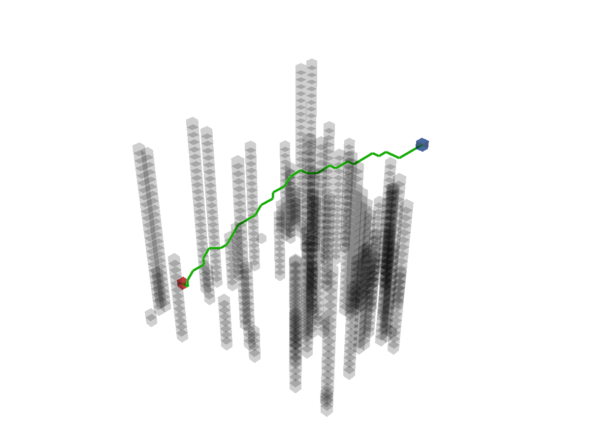

Create the path-planner and plan the path. The hybrid search planner **Voronoi Planner** create the Voronoi map and then depends on **A\*** to plan the path. You can change the base planner by setting argument `base_planner` and pass arguments to base planner by argument `base_planner_kwargs`.
```python
planner = VoronoiPlanner(map_=map_, start=start, goal=goal, base_planner=AStar)
path, path_info = planner.plan()
print(path)
print(path_info)
```

Print results:
```
[(25, 5, 5), (25, 6, 5), (25, 6, 6), (24, 6, 7), (23, 7, 8), (23, 7, 9), (22, 7, 10), (21, 8, 10), (20, 8, 10), (19, 8, 11), (18, 8, 12), (17, 8, 12), (16, 9, 13), (15, 9, 14), (14, 9, 14), (13, 9, 14), (12, 8, 14), (11, 8, 14), (10, 8, 14), (9, 8, 15), (8, 9, 16), (8, 10, 16), (7, 11, 16), (7, 12, 17), (7, 13, 18), (7, 14, 18), (6, 15, 19), (6, 16, 19), (5, 17, 20), (5, 18, 21), (5, 19, 21), (5, 20, 22), (5, 21, 22), (5, 22, 22), (6, 23, 23), (5, 24, 24), (5, 25, 25), (5, 25, 25)]
{'success': True, 'start': (25, 5, 5), 'goal': (5, 25, 25), 'length': 46.92334552620546, 'cost': 46.92334552620546, 'expand': {(25, 6, 5): Node((25, 6, 5), None, 0, 34.07345007480164), ...}, 'voronoi_candidates': array([[[False, False, False, ..., False, False, False], ...]]), 'voronoi_start': (25, 6, 5), 'voronoi_goal': (5, 25, 25), 'voronoi_path': [(25, 6, 5), (25, 6, 6), (24, 6, 7), (23, 7, 8), (23, 7, 9), (22, 7, 10), (21, 8, 10), (20, 8, 10), (19, 8, 11), (18, 8, 12), (17, 8, 12), (16, 9, 13), (15, 9, 14), (14, 9, 14), (13, 9, 14), (12, 8, 14), (11, 8, 14), (10, 8, 14), (9, 8, 15), (8, 9, 16), (8, 10, 16), (7, 11, 16), (7, 12, 17), (7, 13, 18), (7, 14, 18), (6, 15, 19), (6, 16, 19), (5, 17, 20), (5, 18, 21), (5, 19, 21), (5, 20, 22), (5, 21, 22), (5, 22, 22), (6, 23, 23), (5, 24, 24), (5, 25, 25)]}
```

Visualize. If you want to visualize the Voronoi candidates, uncomment the first two line code.
```python
# if "voronoi_candidates" in path_info:
#     map_.type_map[path_info["voronoi_candidates"]] = TYPES.CUSTOM
vis = Visualizer3D()
vis.plot_grid_map(map_)
vis.plot_path(path)
vis.show()
vis.close()
```



Runnable complete code:

```python
import random
random.seed(0)

import numpy as np
np.random.seed(0)

from python_motion_planning.common import *
from python_motion_planning.path_planner import *
from python_motion_planning.controller import *

map_ = Grid(bounds=[[0, 31], [0, 31], [0, 31]], resolution=1.0)
for i in range(75):
    rd_p = tuple(np.random.randint(0, 30, size=3))
    map_.type_map[rd_p[0], rd_p[1], :rd_p[2]] = TYPES.OBSTACLE
map_.inflate_obstacles(radius=3)

start = (25, 5, 5)
goal = (5, 25, 25)

map_.type_map[start] = TYPES.START
map_.type_map[goal] = TYPES.GOAL

planner = VoronoiPlanner(map_=map_, start=start, goal=goal, base_planner=AStar)
path, path_info = planner.plan()
print(path)
print(path_info)
# if "voronoi_candidates" in path_info:
#     map_.type_map[path_info["voronoi_candidates"]] = TYPES.CUSTOM

vis = Visualizer3D()
vis.plot_grid_map(map_)
vis.plot_path(path)
vis.show()
vis.close()
```

For more planners and their arguments, please refer to API Reference.