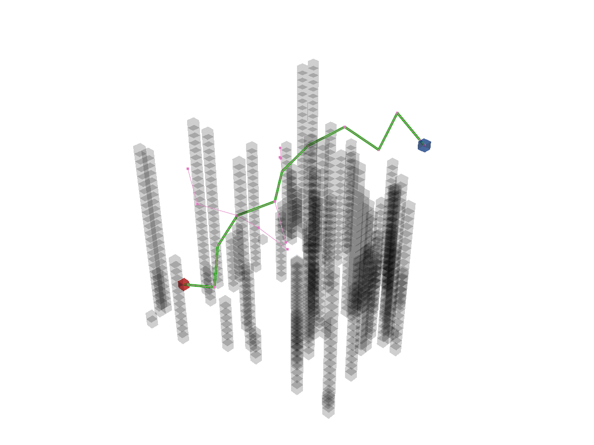
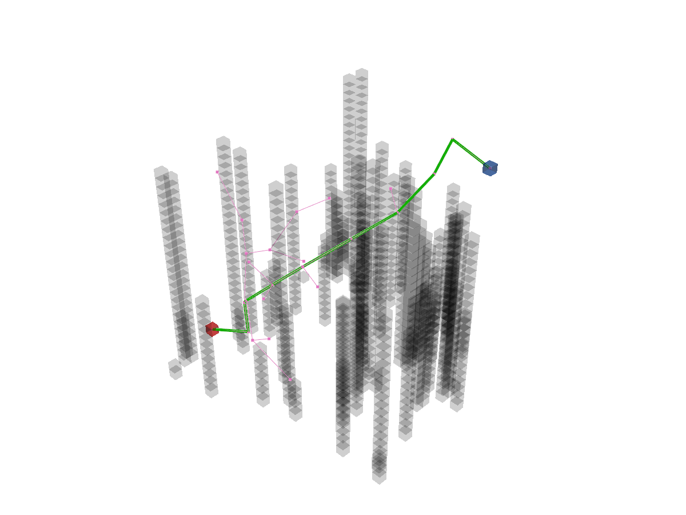
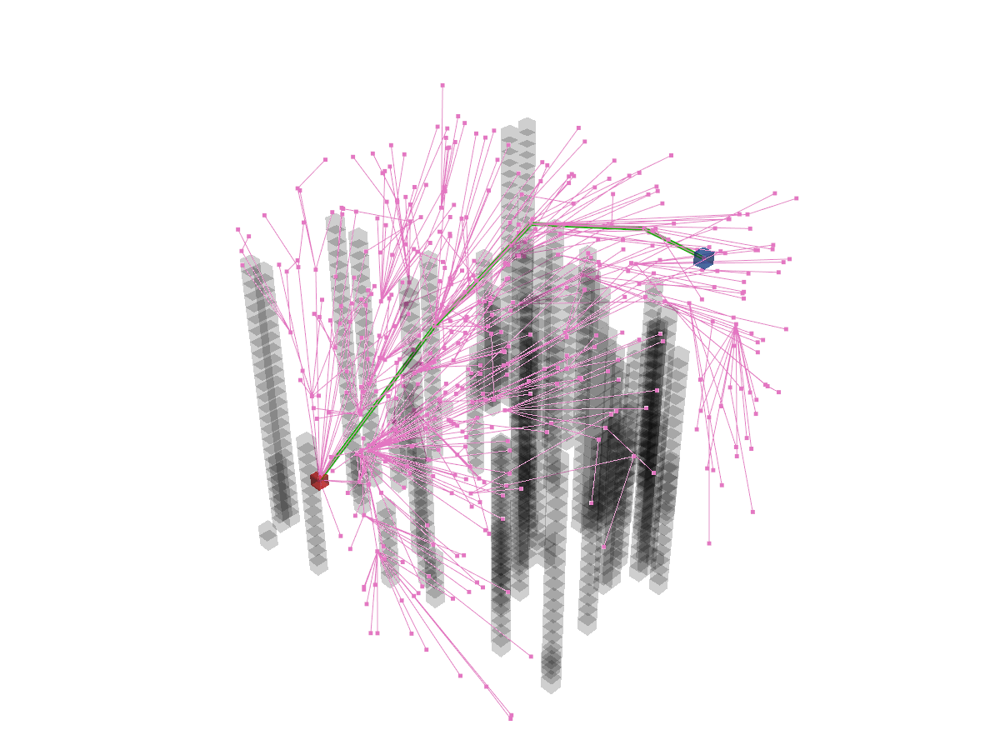

Create the path-planner and plan the path.
```python
planner = RRT(map_=map_, start=start, goal=goal)
path, path_info = planner.plan()
print(path)
print(path_info)
```

Print results:
```
[(25, 5, 5), (23.77816712923369, 9.597070355743302, 6.5408012786407985), (21.443019357729053, 7.8006963883857106, 10.580618781280847), (19.379590365687978, 9.324851433919019, 14.872379747595225), (16.327834122104335, 12.651561812246971, 17.021747535683932), (12.375445502912518, 9.809796156550567, 18.163234356014062), (10.4450443760546, 12.320361503622738, 22.032422013327423), (7.6796466024794565, 15.520628159102692, 24.699043187721863), (5.026879620358288, 18.624158686539474, 21.81270890288309), (3.260514828065661, 19.586636929846392, 26.390218165758466), (4.746375019848422, 24.210706637013622, 25.202700235900696), (5, 25, 25)]       
{'success': True, 'start': (25, 5, 5), 'goal': (5, 25, 25), 'length': 50.85346179120417, 'cost': 50.85346179120417, 'expand': {(25, 5, 5): Node((25, 5, 5), None, 0, 0), ...}}
```

Visualize.
```python
vis = Visualizer3D()
vis.plot_grid_map(map_)
vis.plot_path(path)
vis.plot_expand_tree(path_info["expand"])   # sample-search-featured expand tree
vis.show()
vis.close()
```



Runnable complete code:

```python
import random
random.seed(0)

import numpy as np
np.random.seed(0)

from python_motion_planning.common import *
from python_motion_planning.path_planner import *
from python_motion_planning.controller import *

map_ = Grid(bounds=[[0, 31], [0, 31], [0, 31]], resolution=1.0)
for i in range(75):
    rd_p = tuple(np.random.randint(0, 30, size=3))
    map_.type_map[rd_p[0], rd_p[1], :rd_p[2]] = TYPES.OBSTACLE
map_.inflate_obstacles(radius=3)

start = (25, 5, 5)
goal = (5, 25, 25)

map_.type_map[start] = TYPES.START
map_.type_map[goal] = TYPES.GOAL

planner = RRT(map_=map_, start=start, goal=goal)
path, path_info = planner.plan()
print(path)
print(path_info)

vis = Visualizer3D()
vis.plot_grid_map(map_)
vis.plot_path(path)
vis.plot_expand_tree(path_info["expand"])
vis.show()
vis.close()
```
Sample search planners plan in continuous space by default. If you want to plan in discrete grid map, just set argument `discrete` to `True`. For example:

```python
planner = RRT(map_=map_, start=start, goal=goal, discrete=True)
```

Print results:
```
[(25, 5, 5), (24, 10, 7), (25, 11, 12), (27, 14, 15), (27, 18, 19), (26, 21, 22), (21, 22, 23), (16, 23, 24), (11, 23, 26), (6, 21, 27), (5, 25, 25)]
{'success': True, 'start': (25, 5, 5), 'goal': (5, 25, 25), 'length': 51.21681787317005, 'cost': 51.21681787317005, 'expand': {(25, 5, 5): Node((25, 5, 5), None, 0, 0), ...}}
```



For asymptoticaly optimal sample search planners like **RRT\***, you can set argument `stop_until_sample_num` to `True` and configure `sample_num` to wait for a better result. For example:

```python
RRTStar(map_=map_, start=start, goal=goal, sample_num=1000, stop_until_sample_num=True)
```



For more sample search planners and their arguments, please refer to API Reference.